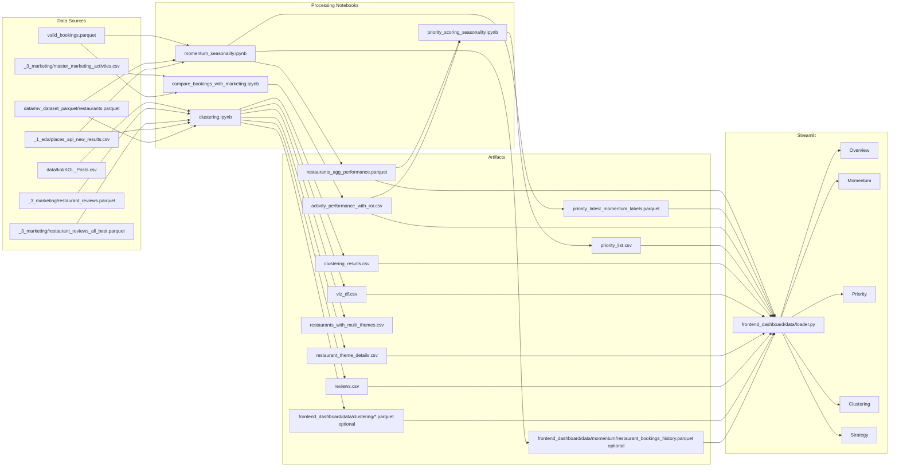
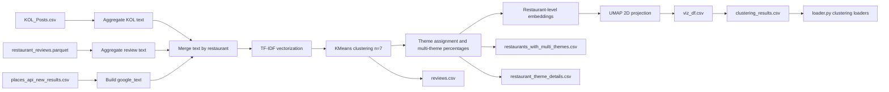

# Technical Breakdown: Streamlit Restaurant Prioritization System

## 1) Executive Summary

The system addresses this business decision problem:

Prioritize which restaurants to market next, and select the best channel/strategy, to maximize bookings and ROI while accounting for current performance and emerging momentum.

The implemented pipeline produces three decision-critical output groups:

- Momentum outputs from `_2_feature_engineering+momentum/start`:
  - `restaurants_agg_performance.parquet` (restaurant-month performance and momentum features, including YoY/MoM fallback logic and growth deltas)
  - `priority_latest_momentum_labels.parquet` (latest restaurant segment labels)
- Marketing effectiveness output from `_3_marketing`:
  - `activity_performance_with_roi.csv` (activity-level lift, incremental revenue, and ROI)
- Final prioritization output from `_4_final_outputs`:
  - `priority_list.csv` (ranked restaurants with score, tier, and recommended channel)
- Clustering outputs from `clustering`:
  - `clustering_results.csv`, `viz_df.csv`, `restaurants_with_multi_themes.csv`, `restaurant_theme_details.csv`, `reviews.csv`
  - Optional normalized exports for the dashboard: `frontend_dashboard/data/clustering/*.parquet`

Decision enabled:

- Which restaurants should be activated now (`priority_score`, `priority_tier`).
- Why they should be activated now (growth trajectory + lift/ROI evidence).
- Which channel/strategy playbook to use (`recommended_channel`, cluster/segment/global strategy ranking).

In short: the system combines momentum detection, seasonality normalization, campaign lift/ROI evidence, and text-based restaurant clustering to convert raw data into actionable targeting and strategy recommendations inside Streamlit.

## 2) Business Problem -> Analytics Objectives Mapping

| Business need | Measurable objective | Implemented metric(s) | Implemented where |
|---|---|---|---|
| Detect emerging winners early | Detect momentum early (growth signals) | `booking_growth_rolling`, `revenue_growth_rolling`, `score_growth`, `delta_growth_book` | `momentum_seasonality.ipynb`, `priority_scoring_seasonality.ipynb` |
| Avoid seasonal false positives | Normalize seasonality with YoY, fallback to MoM | `booking_growth_yoy`, `revenue_growth_yoy`, `booking_growth_mom`, `growth_signal_used`, `has_full_year` | `momentum_seasonality.ipynb` |
| Prove marketing effectiveness | Quantify lift/ROI | `bookings_during`, `bookings_baseline`, `lift`, `lift_per_day`, `incremental_revenue_thb`, `roi` | `compare_bookings_with_marketing.ipynb` |
| Prioritize resource allocation | Composite priority ranking | `priority_score`, `priority_tier`, `recommended_channel` | `priority_scoring_seasonality.ipynb`, `frontend_dashboard/pages/priority.py` |
| Recommend campaign playbook | Recommend channel and tactic family by evidence scope | `strategy_name`, `strategy_family`, `ranking_score`, `context_adjusted_score`, `confidence_score` | `frontend_dashboard/data/loader.py` (`load_cluster_strategy_outcomes`, `_aggregate_strategy_rankings`, `recommend_strategies_for_restaurant`) |
| Business-facing explainability | Provide explainable, drill-down UI | Formula expander, segment matrix, raw campaign evidence table, grounded brief | Streamlit pages (`overview.py`, `momentum.py`, `priority.py`, `clustering.py`, `strategy.py`) |

## 3) Repository / System Layout

### Key structure

```text
OPE/
├─ _1_eda/
│  ├─ places_api_new_results.csv
│  └─ exploratory notebooks (facebook_ads.ipynb, googleapi_explore.ipynb, etc.)
├─ _2_feature_engineering+momentum/
│  └─ start/
│     ├─ momentum.ipynb
│     ├─ momentum_seasonality.ipynb
│     ├─ restaurants_agg_performance.parquet
│     ├─ priority_latest_momentum_labels.parquet
│     ├─ valid_bookings.parquet
│     └─ valid_bookings_with_currency_and_google_restaurants_without_duplicates.parquet
├─ _3_marketing/
│  ├─ compare_bookings_with_marketing.ipynb
│  ├─ master_marketing_activties.csv
│  ├─ activity_performance_lift.csv
│  ├─ activity_performance_with_roi.csv
│  ├─ booking_attribution_one_touch.csv
│  ├─ booking_attribution_all_touches.csv
│  ├─ channel_summary.csv
│  ├─ restaurant_reviews.parquet
│  └─ restaurant_reviews_all_best.parquet
├─ _4_final_outputs/
│  ├─ priority_scoring_seasonality.ipynb
│  └─ priority_list.csv
├─ clustering/
│  ├─ clustering.ipynb
│  ├─ clustering_results.csv
│  ├─ viz_df.csv
│  ├─ restaurants_with_multi_themes.csv
│  ├─ restaurant_theme_details.csv
│  ├─ reviews.csv
│  └─ restaurant_clusters_multi_theme.html
└─ frontend_dashboard/
   ├─ app.py
   ├─ data/loader.py
   └─ pages/
      ├─ overview.py
      ├─ momentum.py
      ├─ priority.py
      ├─ clustering.py
      └─ strategy.py
```

### Pipeline stages (as implemented)

- `_1_eda`: raw data exploration, external API pulls, early cleaning assets.
- `_2_feature_engineering+momentum`: booking aggregation, growth features, seasonality-adjusted momentum scoring, segment labeling.
- `_3_marketing`: campaign attribution, baseline-vs-during lift, incremental revenue, ROI.
- `_4_final_outputs`: stable-growth filtering, priority scoring, tiering, channel recommendation, export `priority_list.csv`.
- `clustering`: NLP feature space + cluster/theme artifacts for strategy context.
- `frontend_dashboard`: data loading, scoring explainability, cluster exploration, strategy recommendation.
## 4) Data Architecture (end-to-end)



### Datasets loaded in `frontend_dashboard/data/loader.py`

`BASE_DIR = Path(__file__).resolve().parent.parent.parent` (repo root)

| Constant | Exact path expression in code | Current file status | Important columns (observed/inferred) | Grain | Refresh cadence assumption + rerun point | Downstream consumer |
|---|---|---|---|---|---|---|
| `MOMENTUM_PATH` | `BASE_DIR / "_2_feature_engineering+momentum" / "start" / "restaurants_agg_performance.parquet"` | Present | `restaurant_id`, `name`, `year_month`, `monthly_bookings`, `monthly_revenue`, `booking_growth_mom`, `booking_growth_yoy`, `growth_signal_used`, `booking_growth_rolling`, `score_perf`, `score_growth`, `delta_growth_book` | Restaurant-month | Manual notebook run; rerun `_2_feature_engineering+momentum/start/momentum_seasonality.ipynb` | `load_momentum()` -> Overview, Momentum, Priority (via universe), Clustering enrich, Strategy trend |
| `MOMENTUM_LABELS_PATH` | `BASE_DIR / "_2_feature_engineering+momentum" / "start" / "priority_latest_momentum_labels.parquet"` | Present | `restaurant_id`, `name`, `latest_segment`, `score_perf`, `score_growth`, `year_month` | Restaurant latest snapshot | Manual; rerun `momentum_seasonality.ipynb` or `priority_scoring_seasonality.ipynb` | `load_momentum_segments()` -> Momentum fallback, Priority universe merge, Clustering enrich |
| `MARKETING_PATH` | `BASE_DIR / "_3_marketing" / "activity_performance_with_roi.csv"` | Present | `activity_id`, `channel`, `restaurant_id`, `activity_start`, `activity_end`, `bookings_baseline`, `bookings_during`, `lift`, `lift_per_day`, `incremental_revenue_thb`, `roi`, `fb_*`, `crm_*`, `kol_*` | Campaign/activity | Manual; rerun `_3_marketing/compare_bookings_with_marketing.ipynb` | `load_marketing()` -> strategy outcome synthesis in loader |
| `PRIORITY_PATH` | `BASE_DIR / "_4_final_outputs" / "priority_list.csv"` | Present | `rank`, `name`, `restaurant_id`, `priority_score`, `priority_tier`, `recommended_channel`, `latest_segment`, `score_growth`, `delta_growth_book`, `has_marketing`, `avg_lift_per_day`, `avg_roi` | Restaurant latest ranked | Manual; rerun `_4_final_outputs/priority_scoring_seasonality.ipynb` | `load_priority()` -> Overview, Momentum fallback info, Priority, Strategy |
| `MOMENTUM_VALID_BOOKINGS_PATH` | `BASE_DIR / "_2_feature_engineering+momentum" / "start" / "valid_bookings.parquet"` | Present | `id`, `restaurant_id`, `booking_date`, `created_at`, `start_time`, `channel`, `medium`, `adult`, `kids`, `revenue_dollars`, status flags | Booking/event | Manual upstream ETL + momentum notebook | `load_momentum_raw_bookings()` fallback |
| `MOMENTUM_VALID_BOOKINGS_ENRICHED_PATH` | `BASE_DIR / "_2_feature_engineering+momentum" / "start" / "valid_bookings_with_currency_and_google_restaurants_without_duplicates.parquet"` | Present | `id`, `restaurant_id`, `name`, `booking_date`, `created_at`, `adult`, `kids`, `total_guests`, `revenue_thb`, `revenue_dollars`, `channel`, `medium`, place metadata | Booking/event | Manual; rerun momentum notebook | `load_momentum_raw_bookings()` fallback |
| `MOMENTUM_BOOKINGS_EXPORT_PATH` | `Path(__file__).resolve().parent / "momentum" / "restaurant_bookings_history.parquet"` | Not present in current snapshot | Standardized columns expected by loader: `booking_id`, `restaurant_id`, `restaurant_name`, `booking_date`, `channel`, guests, revenue, status flags | Booking/event | Optional manual export step (Cell 52 in `momentum.ipynb`) | Overview raw booking drill-down |
| `CLUSTER_ASSIGN_EXPORT_PATH` | `Path(__file__).resolve().parent / "clustering" / "restaurant_cluster_assignments.parquet"` | Not present in current snapshot | `restaurant_id`, `name`, `cluster_id`, `cluster_label`, `x`, `y`, `cluster_confidence`, optional momentum fields | Restaurant | Optional manual export (Step 10 in `clustering.ipynb`) | `load_cluster_assignments()` primary source |
| `CLUSTER_KEYWORDS_EXPORT_PATH` | `Path(__file__).resolve().parent / "clustering" / "cluster_keywords.parquet"` | Not present in current snapshot | `cluster_id`, `keyword`, `weight`, `rank` | Cluster-keyword | Optional manual export | `load_cluster_keywords()` primary source |
| `CLUSTER_TEXT_EXPORT_PATH` | `Path(__file__).resolve().parent / "clustering" / "restaurant_text_corpus.parquet"` | Not present in current snapshot | `name`, `text_id`, `raw_text`, `clean_text`, `cluster_id`, `year_month` | Text record (restaurant text row) | Optional manual export | `load_cluster_text_corpus()` primary source |
| `CLUSTER_STRATEGY_EXPORT_PATH` | `Path(__file__).resolve().parent / "clustering" / "cluster_strategy_outcomes.parquet"` | Not present in current snapshot | `cluster_id`, `cluster_label`, `strategy_name`, `strategy_family`, `restaurant_name`, `bookings_before`, `bookings_after`, `revenue_uplift_pct`, `roi`, `sample_size` | Campaign activity with cluster context | Optional manual export | `load_cluster_strategy_outcomes()` primary source |
| `CLUSTER_RESULTS_PATH` | `BASE_DIR / "clustering" / "clustering_results.csv"` | Present | Raw cluster assignment with UMAP/theme columns and `restaurant_id` | Restaurant | Manual; rerun `clustering.ipynb` | `load_cluster_assignments()` fallback source 1 |
| `VIZ_DF_PATH` | `BASE_DIR / "clustering" / "viz_df.csv"` | Present | `restaurant name`, UMAP components, `cluster`, `Primary Theme`, post counts | Restaurant | Manual; rerun `clustering.ipynb` | `load_cluster_assignments()` fallback source 2 |
| `MULTI_THEME_PATH` | `BASE_DIR / "clustering" / "restaurants_with_multi_themes.csv"` | Present but not directly loaded in current loader flow | `restaurant name`, `Primary Theme`, `All Themes`, `Number of Posts`, `Primary Theme %` | Restaurant | Manual; rerun `clustering.ipynb` | Not directly consumed by loader/page code in current snapshot |
| `THEME_DETAILS_PATH` | `BASE_DIR / "clustering" / "restaurant_theme_details.csv"` | Present | `restaurant name`, `cluster`, `theme`, `post_count`, `total_posts`, `percentage` | Restaurant-theme | Manual; rerun `clustering.ipynb` | `load_cluster_keywords()` fallback source |
| `REVIEWS_PATH` | `BASE_DIR / "clustering" / "reviews.csv"` | Present | `restaurant name`, `text`, `cluster`, `theme` | Restaurant text aggregate | Manual; rerun `clustering.ipynb` | `load_cluster_text_corpus()` fallback source |

## 5) Data Ingestion & Cleaning (Step-by-step)

### A) Bookings + restaurant metadata ingestion (`momentum.ipynb` and `momentum_seasonality.ipynb`)

1. Read bookings base:
   - `_2_feature_engineering+momentum/start/valid_bookings.parquet`
2. Remove known outlier restaurants by ID:
   - `outlier_ids = [4503, 4502, 933, 837]`
3. Join restaurant metadata:
   - `data/mv_dataset_parquet/restaurants.parquet` on `restaurant_id`
4. Join Google API enrichments:
   - `_1_eda/places_api_new_results.csv` merged by restaurant name (`name` -> `input_string`)
5. Drop low-quality identity rows:
   - remove rows where `user_id_masked` is empty or null
6. Deduplicate system duplicate bookings:
   - dedupe keys: `user_id_masked`, `restaurant_id`, `booking_date`, `start_time`, `end_time`, `active`
   - keep highest `id`
7. Keep Thailand only:
   - `final_bookings_df = final_bookings_df[final_bookings_df['country'] == 'Thailand']`
8. Parse dates and enforce required columns.
9. Currency conversion:
   - map country to currency code
   - fetch live rates from `https://open.er-api.com/v6/latest/THB` with fallback static rates
   - derive `revenue_thb` from `revenue_dollars` using rate conversion logic
10. Guest normalization:
    - derive `total_guests = adult + kids` when missing

### B) Booking aggregation + active universe

1. Build `year_month` from `booking_date`.
2. Cap analysis horizon:
   - keep months `<= 2026-01-31` in notebook logic.
3. Aggregate to restaurant-month:
   - `monthly_bookings` (count of booking `id`)
   - `monthly_revenue` (sum `revenue_thb`)
   - `avg_revenue_per_booking`
   - `avg_guests`
   - `active_days` (distinct booking dates)
4. Keep full history for active restaurants:
   - identify restaurants with latest activity within last 12 months
   - keep full prior history for YoY calculations
5. Mark analysis window:
   - `in_analysis_window = year_month >= cutoff_date`

### C) Marketing campaign ingestion (`compare_bookings_with_marketing.ipynb`)

1. Read campaign master:
   - `_3_marketing/master_marketing_activties.csv`
2. Construct canonical `restaurant_id`:
   - coalesce `crm_restaurant_id`, `kol_restaurant_id`, `fb_restaurant_id`
3. Normalize campaign times:
   - parse `activity_start`, `activity_end`
   - fallback missing `activity_end` using `fb_campaign_duration_days`
   - fallback remaining missing end date to current date
   - enforce `activity_end >= activity_start`
4. Normalize booking timestamp:
   - `booking_datetime = created_at`, fallback to `start_time`
5. Attribution interval join:
   - candidate join on `restaurant_id`
   - keep bookings with timestamp in `[activity_start, activity_end]`
6. Overlap resolution:
   - for multiple matching activities, pick activity with smallest absolute hours from start (`abs_time_from_start_hours`)
7. Export:
   - `booking_attribution_one_touch.csv`
   - `booking_attribution_all_touches.csv`

### D) Review/text ingestion (`clustering.ipynb`)

1. Read text sources:
   - `data/kol/KOL_Posts.csv`
   - `_3_marketing/restaurant_reviews.parquet`
   - `_3_marketing/restaurant_reviews_all_best.parquet` (loaded, not central in clustering pipeline cells)
   - `_1_eda/places_api_new_results.csv`
2. Build combined text:
   - KOL content aggregation by restaurant
   - Google fields (`input_string`, `raw_types`, `Cuisine`) concatenated into `google_text`
   - review text concatenated into `rest_reviews`
3. Aggregate to one text document per restaurant:
   - output dataframe `reviews` with columns `restaurant name`, `text`

### E) Notes on not-yet-implemented metrics

- Conversion rate and engagement rate are not currently implemented in code.
- Recommended insertion points:
  - Add campaign-level conversion/engagement features in `_3_marketing/compare_bookings_with_marketing.ipynb` and append to `activity_performance_with_roi.csv`.
  - Aggregate to restaurant-level in `priority_scoring_seasonality.ipynb` (`rest_mkt`) and include in `marketing_component`.
## 6) Feature Engineering & Momentum Model

### Core feature set

From `momentum_seasonality.ipynb`:

- Volume/value features:
  - `monthly_bookings`, `monthly_revenue`, `avg_revenue_per_booking`, `avg_guests`, `active_days`
- Growth features:
  - `booking_growth_mom`, `revenue_growth_mom`
  - `booking_growth_yoy`, `revenue_growth_yoy`
  - blended growth: `booking_growth_pct`, `revenue_growth_pct`
  - smoothed growth: `booking_growth_rolling`, `revenue_growth_rolling` (3-month rolling average)
- Growth signal traceability:
  - `months_of_history`, `has_full_year`, `growth_signal_used` (`YoY` or `MoM`)
- Performance/momentum score features:
  - `log_bookings`, `log_rev`, `score_perf`, `score_growth`
- Acceleration features:
  - `delta_growth_book`, `delta_growth_rev`
  - plus size deltas `delta_size_book`, `delta_size_rev`

### YoY vs MoM fallback and seasonality adjustment

Pseudo-logic:

```text
booking_growth_mom = pct_change(monthly_bookings, 1)
booking_growth_yoy = pct_change(monthly_bookings, 12)
has_full_year = months_of_history >= 12

if has_full_year and booking_growth_yoy is not null:
    booking_growth_pct = booking_growth_yoy
    growth_signal_used = "YoY"
else:
    booking_growth_pct = booking_growth_mom
    growth_signal_used = "MoM"

booking_growth_rolling = rolling_mean(booking_growth_pct, window=3)
```

Why this captures momentum:

- YoY suppresses monthly seasonality effects when history exists.
- MoM fallback avoids dropping new restaurants.
- Rolling averages reduce noisy month spikes.
- Delta terms (`delta_growth_*`) detect acceleration, not just level.

### `score_perf` and `score_growth` (as implemented)

`score_perf`:

- `log_bookings = log1p(monthly_bookings)`
- `log_rev = log1p(monthly_revenue)`
- `score_perf = 0.5 * min_max(log_bookings) + 0.5 * min_max(log_rev)`

`score_growth`:

- cap growth inputs to bounded range (`-1.0` to `2.0`) after replacing infs
- `score_growth = min_max(0.5 * revenue_growth_rolling + 0.5 * min_max(booking_growth_rolling))`

### Segmentation outputs

Segmenting logic uses 75th percentile cutoffs of latest snapshot:

- `perf_threshold = latest.score_perf.quantile(0.75)`
- `growth_threshold = latest.score_growth.quantile(0.75)`

Segment rules:

- `Rising Stars`: high perf and high growth
- `Emerging Opportunities`: low perf, high growth
- `Established Players`: high perf, low growth
- `Needs Attention`: low perf, low growth

Persisted labels:

- latest labels are exported to `priority_latest_momentum_labels.parquet`
- full scored analysis window is exported to `restaurants_agg_performance.parquet`

## 7) Marketing Lift & ROI Computation

### Window definitions from `compare_bookings_with_marketing.ipynb`

- During/campaign window:
  - `booking_datetime in [activity_start, activity_end]`
- Baseline/before window:
  - same duration immediately before campaign
  - `baseline_start = activity_start - window_hours`
  - `baseline_end = activity_start`
- After window:
  - not explicitly modeled as a separate post-period metric in current notebook code.

### Lift and financial formulas

- `bookings_during = count(bookings in campaign window)`
- `bookings_baseline = count(bookings in baseline window)`
- `lift = bookings_during - bookings_baseline`
- `lift_per_day = lift / window_days`

Revenue and ROI:

- `total_campaign_revenue = sum(revenue_thb of attributed one-touch bookings)`
- `aov_thb = total_campaign_revenue / bookings_during` (if `bookings_during > 0`, else 0)
- `incremental_revenue_thb = lift * aov_thb`
- `roi = (incremental_revenue_thb - fb_amount_spent_thb) / fb_amount_spent_thb` for FB campaigns with spend only

### Data quality and stability guardrails

In notebook:

- Enforce valid windows (`window_hours > 0`, `activity_end >= activity_start`)
- Drop rows with missing critical IDs/timestamps
- One-touch overlap resolution by nearest campaign start

In dashboard loader (`load_cluster_strategy_outcomes`):

- Recompute uplift only when baseline is credible:
  - revenue baseline threshold: `revenue_before >= 100 THB`
  - booking baseline threshold: `bookings_before >= 5`
- Remove unstable ratios:
  - keep uplift pct only if within `[-0.99, 20.0]`

## 8) Priority Scoring Framework (explicit)

Implemented in `frontend_dashboard/pages/priority.py` (`add_priority_breakdown_cols`) and aligned with `priority_scoring_seasonality.ipynb`:

```text
growth_component = 0.60*score_growth_norm + 0.40*delta_growth_norm
marketing_component = 0.60*lift_norm*lift_reliability + 0.40*roi_norm
if has_marketing: priority_raw = 0.60*growth_component + 0.40*marketing_component
else: priority_raw = growth_component_norm
final priority_score = min_max_norm(priority_raw)*100
```

Term definitions:

- `score_growth_norm`: min-max normalized `score_growth`.
- `delta_growth_norm`: min-max normalized `delta_growth_book`.
- `lift_norm`: min-max normalized positive `avg_lift_per_day`.
- `roi_norm`: min-max normalized positive `avg_roi`.
- `lift_reliability`:
  - in page logic: `lift_reliability_calc = 0.8 + 0.2*pct_yoy_baseline` when `pct_yoy_baseline` exists, else `1.0`.
  - interpretation: campaigns measured with more YoY baselines get slightly higher trust.
- `growth_component_norm`: fallback normalization used for restaurants with no marketing history.

Tier logic (`priority_scoring_seasonality.ipynb`):

- Proven response:
  - `has_marketing == True` and `avg_lift_per_day > 0`
  - label: `Activate - proven marketing response`
- Untapped:
  - `has_marketing == False`
  - label: `Activate - untapped, no prior spend`
- Review strategy:
  - has marketing history but no positive lift signal
  - label: `Activate - review channel strategy`

Additional page-level assumption:

- `build_priority_universe()` merges all latest momentum restaurants with priority list and marks non-priority rows as:
  - `Monitor - outside stable-growth priority universe`
## 9) Clustering Engine (NLP)

### Pipeline summary from `clustering.ipynb`

- Input text:
  - KOL posts (`KOL_Posts.csv`)
  - restaurant reviews (`restaurant_reviews.parquet`)
  - Google place context (`raw_types`, `Cuisine`, `input_string`)
- Preprocessing:
  - concatenate text fields per restaurant into one `text`
- Vectorization:
  - `TfidfVectorizer(max_features=200, ngram_range=(1,2), stop_words='english', min_df=2)`
- Clustering:
  - `KMeans(n_clusters=7, random_state=42, n_init=10)`
- Theme assignment:
  - manual map dictionary provided for clusters `0..4`
  - multi-theme assignment uses per-restaurant theme share threshold (`>=20%`)
- Visualization:
  - restaurant-level embedding = mean TF-IDF vector of associated posts
  - `UMAP(n_components=2, n_neighbors=30, min_dist=1, metric='cosine')`

### Clustering artifacts generated

- `reviews.csv` (text + cluster)
- `viz_df.csv` (2D map coordinates + theme metadata)
- `restaurants_with_multi_themes.csv` (primary + combined themes)
- `restaurant_theme_details.csv` (theme percentages per restaurant)
- `clustering_results.csv` (cluster output merged with restaurant IDs)
- `restaurant_clusters_multi_theme.html` (interactive plot)
- Optional dashboard exports:
  - `frontend_dashboard/data/clustering/restaurant_cluster_assignments.parquet`
  - `frontend_dashboard/data/clustering/cluster_keywords.parquet`
  - `frontend_dashboard/data/clustering/restaurant_text_corpus.parquet`
  - `frontend_dashboard/data/clustering/cluster_strategy_outcomes.parquet`

### Outputs consumed by the app

- Cluster assignments per restaurant:
  - loaded via `load_cluster_assignments()`
  - fallback order: normalized parquet export -> `clustering_results.csv` -> `viz_df.csv`
  - unassigned momentum restaurants are injected as `cluster_id = -1`, label `Unclustered - no clustering text`
- Cluster keywords/themes:
  - via `load_cluster_keywords()`
  - sources: export parquet, derived token frequencies from corpus, fallback `restaurant_theme_details.csv`
- Text corpus:
  - via `load_cluster_text_corpus()`
  - sources: export parquet or `reviews.csv`
- Multi-theme mapping:
  - generated in notebook (`restaurants_with_multi_themes.csv`)
  - not directly consumed by current loader/page code.


## 10) Strategy Engine (recommendations)

### `recommend_strategies_for_restaurant` flow (`frontend_dashboard/data/loader.py`)

1. Resolve restaurant context:
   - normalize name
   - locate row in `load_cluster_assignments()`
   - extract `cluster_id`, `cluster_label`, `latest_segment`
   - lookup priority row for `priority_tier` and `recommended_channel`
2. Build candidate recommendations from three scopes:
   - cluster-level: `load_strategy_rankings(scope_type="cluster")`
   - segment-level: `load_strategy_rankings(scope_type="segment")`
   - global-level: `load_strategy_rankings(scope_type="global")`
3. Rank and blend:
   - add `scope_weight` (`cluster=3`, `segment=2`, `global=1`)
   - compute `context_boost` via `_contextual_strategy_boost(...)`
   - `context_adjusted_score = ranking_score + context_boost + scope_weight`
4. Deduplicate by `strategy_name`, keep top `N`.
5. Add rationale labels:
   - `recommendation_reason` in `{Cluster history, Momentum segment history, Global platform history}`

### How outcomes table is created (`load_cluster_strategy_outcomes`)

- Primary source: `CLUSTER_STRATEGY_EXPORT_PATH` parquet (if exists).
- Fallback synthesis:
  - join `load_marketing()` and `load_cluster_assignments()` on `restaurant_id`
  - derive `strategy_name` and `strategy_family`
  - compute/recompute:
    - `bookings_before`, `bookings_after`
    - `bookings_uplift_pct`
    - `revenue_before`, `revenue_after`, `revenue_uplift_pct`
    - `incremental_revenue_thb`, `roi`
  - apply baseline guardrails and clipping for unstable uplift.

### Scope ranking aggregation (`_aggregate_strategy_rankings`)

Aggregates by:

- Cluster scope: `group by [cluster_id, cluster_label, strategy_name]`
- Segment scope: `group by [latest_segment, strategy_name]`
- Global scope: `group by [strategy_name]`

Core aggregate metrics:

- `activities`, `restaurants`
- `avg_incremental_revenue_thb`, `total_incremental_revenue_thb`
- `avg_revenue_uplift_pct`, `avg_bookings_uplift_pct`, `avg_roi`
- `success_rate` = share of rows with positive incremental revenue

Ranking score:

```text
revenue_component = avg_revenue_uplift_pct
if avg_revenue_uplift_pct is null:
    revenue_component = avg_incremental_revenue_thb / max_abs_incremental_revenue_within_scope

ranking_score = revenue_component*100 + avg_bookings_uplift_pct*30 + avg_roi*10 + success_rate*5
```

Sample guardrails and confidence:

- Eligibility: `activities >= min_sample_size` (default 3)
- Confidence score:
  - `0.40*activity_scale + 0.20*restaurant_scale + 0.25*success_rate + 0.15*metric_coverage`, scaled to 0-100
- Confidence level:
  - `High >= 75`, `Medium >= 55`, else `Low`
- Data quality note:
  - low sample, partial metric coverage, or confidence evidence label

### Context boosts (`_contextual_strategy_boost`)

Boosts are deterministic text-rule adjustments based on:

- momentum segment
- priority tier
- preferred channel match

Examples:

- Needs Attention + reactivation/retarget terms gets strong positive boost.
- Rising Stars + creator/influencer/prospecting gets positive boost.
- Preferred channel prefix match adds small boost.

### Final returned fields

`recommend_strategies_for_restaurant(...)` returns rows that include:

- Restaurant context:
  - `restaurant_name`, `restaurant_segment`, `restaurant_cluster_id`, `restaurant_cluster_label`, `restaurant_priority_tier`, `restaurant_preferred_channel`
- Strategy fields:
  - `strategy_name`
  - `recommendation_scope` (`cluster`, `segment`, `global`)
  - `recommendation_reason` (rationale)
  - uplift/ROI evidence (`avg_revenue_uplift_pct`, `avg_bookings_uplift_pct`, `avg_roi`)
  - confidence (`confidence_score`, `confidence_level`, `data_quality_note`)
  - scores (`ranking_score`, `context_adjusted_score`)

### Deterministic brief vs optional AI narrative (`strategy.py`)

- Deterministic source of truth:
  - `build_grounded_brief(row, hist, recs)` generates markdown strategy brief from observed data only.
- Optional AI narrative:
  - `call_claude(prompt)` uses `ANTHROPIC_API_KEY` and Anthropic Messages API.
  - Prompt is derived from grounded brief plus top strategy rows.
  - UI explicitly states deterministic brief is source of truth.
## 11) Streamlit Application Integration

### App shell (`frontend_dashboard/app.py`)

- Top navigation uses horizontal `st.radio`:
  - `Overview`, `Momentum`, `Priority`, `Clustering`, `Strategy`
- Routing:
  - each selected page imports corresponding module and calls `render()`

### Page-by-page integration

| Page | Loader functions used | Main visuals/KPIs | Decision support | Business-problem linkage |
|---|---|---|---|---|
| `overview.py` | `load_momentum`, `load_priority`, `load_momentum_raw_bookings`, `get_restaurant_history`, `get_restaurant_priority_row`, `get_restaurant_booking_history` | Restaurant header with segment/tier, KPI cards, booking/revenue/growth charts, full latest table, raw booking record drill-down | Validate individual restaurant quality, inspect growth signal (`YoY`/`MoM`), audit raw bookings | Supports confidence and explainability before activation |
| `momentum.py` | `load_momentum`, `load_priority` | Portfolio KPIs, segment donut, perf-vs-growth matrix, growth-signal split, stability chart, growth heatmap, top movers list | Identify which restaurants are structurally growing vs lagging | Core momentum detection and segment monitoring |
| `priority.py` | `load_priority`, `load_momentum`, `load_momentum_segments` via `build_priority_universe` | Priority tier counts, formula explainer expander, score distribution, channel mix, filterable ranked bars/cards | Decide activation order and interpret score components per restaurant | Direct prioritization list for marketing allocation |
| `clustering.py` | `load_cluster_assignments`, `load_cluster_text_corpus`, `load_cluster_keywords`, `load_cluster_strategy_outcomes`, `load_cluster_strategy_rankings`, `get_cluster_strategy_recommendations` | Interactive cluster map, restaurant table cross-highlight, word clouds, raw text table, momentum mix, strategy effectiveness table | Understand restaurant theme cluster and what tactics historically worked in that cluster | Links qualitative demand themes to actionable strategy evidence |
| `strategy.py` | `load_priority`, `load_momentum`, `get_restaurant_history`, `get_restaurant_priority_row`, `recommend_strategies_for_restaurant` | Restaurant profile card, booking trend with YoY line, campaign history stats, ranked strategy evidence table, grounded brief, optional AI narrative | Choose concrete strategy mix for selected restaurant with evidence and confidence | Final action layer: who to market and how to market |

## 12) End-to-End Data Lineage Table

| Output artifact | Produced by | Inputs | Key transformations | Used by |
|---|---|---|---|---|
| `_2_feature_engineering+momentum/start/restaurants_agg_performance.parquet` | `momentum_seasonality.ipynb` (Cell 47) | `valid_bookings.parquet`, `restaurants.parquet`, `places_api_new_results.csv` | Booking cleaning, dedupe, country filter, THB conversion, monthly aggregation, YoY/MoM blended growth, rolling growth, scores, deltas | `loader.load_momentum()` -> Overview/Momentum/Priority/Clustering/Strategy |
| `_2_feature_engineering+momentum/start/priority_latest_momentum_labels.parquet` | `momentum_seasonality.ipynb` (Cell 50) and also regenerated in `priority_scoring_seasonality.ipynb` (Cell 25) | Latest momentum snapshot | Segment assignment and latest label persistence | `loader.load_momentum_segments()` |
| `_3_marketing/activity_performance_with_roi.csv` | `compare_bookings_with_marketing.ipynb` (Cell 8) | Enriched bookings + `master_marketing_activties.csv` | One-touch attribution, baseline-vs-during lift, lift/day, incremental revenue, ROI | `loader.load_marketing()`, priority scoring notebook |
| `_4_final_outputs/priority_list.csv` | `priority_scoring_seasonality.ipynb` (Cell 25) | `restaurants_agg_performance.parquet`, `activity_performance_with_roi.csv` | Stable-growth filter, growth/marketing components, priority score, tier, channel recommendation | `loader.load_priority()` -> Overview/Momentum/Priority/Strategy |
| `clustering/viz_df.csv` | `clustering.ipynb` (Cell 13/14) | Aggregated text corpus | TF-IDF, KMeans, restaurant embedding, UMAP projection | `loader.load_cluster_assignments()` fallback |
| `clustering/clustering_results.csv` | `clustering.ipynb` (Cell 18) | `single_theme` + restaurants table | Merge theme assignments with `restaurant_id` | `loader.load_cluster_assignments()` fallback |
| `clustering/restaurants_with_multi_themes.csv` | `clustering.ipynb` (Cell 16) | Restaurant theme counts | Multi-theme combination with threshold filtering | Not directly consumed by current app code |
| `clustering/restaurant_theme_details.csv` | `clustering.ipynb` (Cell 16) | Theme counts by restaurant | Per-theme percentages per restaurant | `loader.load_cluster_keywords()` fallback |
| `clustering/reviews.csv` | `clustering.ipynb` (Cell 7) | Combined restaurant text | Persist text with cluster label | `loader.load_cluster_text_corpus()` fallback |
| `frontend_dashboard/data/clustering/cluster_strategy_outcomes.parquet` (optional) | `clustering.ipynb` Step 10 (Cell 22) | `activity_performance_with_roi.csv` + cluster assignments | Join campaign performance to cluster context and compute uplift/ROI fields | `loader.load_cluster_strategy_outcomes()` primary source when present |
| `frontend_dashboard/data/momentum/restaurant_bookings_history.parquet` (optional) | `momentum.ipynb` Step 12 (Cell 52) | bookings dataframe from notebook state or local parquet fallback | Standardize raw booking columns for dashboard drill-down | Overview raw booking table via `load_momentum_raw_bookings()` |

## 13) Assumptions, Limitations, Next Improvements

### What is implemented vs requested

- Implemented:
  - Momentum detection with rolling growth and segmentation.
  - Seasonality normalization (YoY with MoM fallback).
  - Campaign lift/incremental revenue/ROI metrics.
  - Priority scoring with growth and marketing components.
  - Cluster-aware strategy ranking and explainable Streamlit drill-down.
- Not currently implemented in code:
  - Explicit conversion-rate metric.
  - Explicit engagement-rate metric.
  - Causal uplift model (current approach is observational pre-vs-during).
  - Multi-touch attribution (current production output is one-touch campaign assignment).

### Technical limitations observed

- Clustering notebook sets `KMeans(n_clusters=7)` but manual `cluster_themes` map is only defined for IDs 0-4.
- `priority_list.csv` current snapshot does not include all optional seasonality columns listed in notebook output comments.
- Dashboard clustering parquet exports in `frontend_dashboard/data/clustering` are absent in current snapshot; loader relies on CSV fallbacks.
- Priority notebook uses a fixed `YOY_CUTOFF = 2025-08-01` to flag YoY baseline availability, rather than deriving from each restaurant's true historical coverage.
- `score_perf` comments indicate analysis-window scoring intent, but implementation normalizes over the dataframe passed at computation time.

### Recommended improvements (5-10)

1. Add causal uplift modeling (e.g., CausalImpact, synthetic controls, or doubly robust uplift estimators) for campaign impact beyond simple pre/during comparisons.
2. Implement multi-touch attribution (MTA) using booking-level touch paths and time-decay/Shapley style credit assignment.
3. Add explicit conversion and engagement features to campaign outputs and include them in priority/strategy scoring.
4. Strengthen seasonality model with holiday/event regressors and location-level seasonal baselines, not only YoY fallback.
5. Automate the pipeline with scheduled orchestration (e.g., Airflow/Prefect/GitHub Actions) and environment-parameterized cutoff dates.
6. Add data quality tests (Great Expectations or custom checks) for key fields, joins, and metric ranges before artifact publication.
7. Add model/data monitoring dashboards for drift in growth signals, score distributions, and channel ROI stability.
8. Add unit tests for critical scoring functions in `loader.py` and `priority.py` (`min_max_norm`, ranking score, context boost, confidence scoring).
9. Version and validate output schemas (contract tests) so Streamlit pages fail fast on broken artifact structure.
10. Extend strategy engine to include budget-aware optimization (expected uplift under spend constraints) instead of ranking-only outputs.
