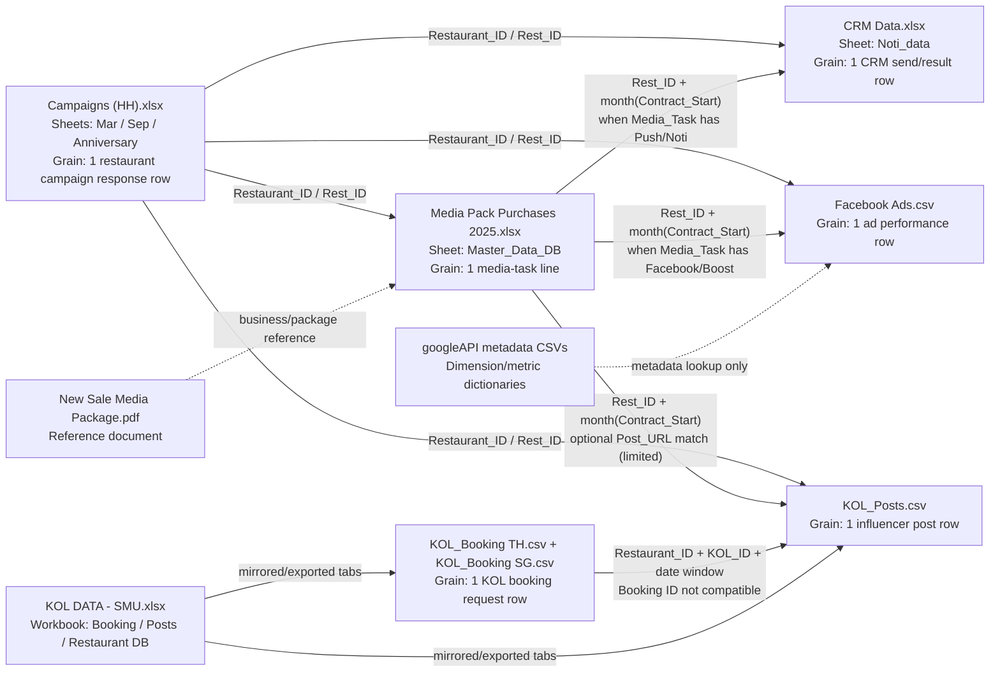

# HungryHub Marketing Data Model (excluding `mv_dataset_parquet`)

## 1) What corresponds to what

- `media_purchases/Media Pack Purchases 2025.xlsx` (`Master_Data_DB`) is the best central table.
- `marketing/CRM Data.xlsx` (`Noti_data`) corresponds mainly to media tasks like `Push Notification`.
- `marketing/Facebook Ads.csv` corresponds to media tasks like `Boost post` / `HH Facebook Post`.
- `marketing/Campaigns (HH).xlsx` corresponds to campaign participation/planning per restaurant and links to the other files via restaurant id.
- `kol/KOL_Posts.csv` corresponds to influencer execution/performance and links best by restaurant id + timing (weak direct URL overlap).

## 2) Entity relationship diagram

## 3) Practical join keys (recommended)

| From | To | Join keys | Strength |
|---|---|---|---|
| `Master_Data_DB` | `CRM Noti_data` | `Rest_ID = rest_id` and `month(Contract_Start) = month(Sent Date)` and `Media_Task` contains `push/noti` | Strong for notification analysis |
| `Master_Data_DB` | `Facebook Ads.csv` | `Rest_ID` to any of (`Rest ID`, `Rest 2`, `Rest 3`, `Rest 4`, `Rest 5`) and month alignment | Medium (ad can include multiple restaurants) |
| `Campaigns (HH)` | all other marketing tables | `Restaurant_ID`/`Rest_ID` to restaurant id fields | Strong as shared restaurant key |
| `Master_Data_DB` | `KOL_Posts.csv` | `Rest_ID = Restaurant Code`, plus month/date overlap; `Post_URL` exact match only in a few rows | Weak to medium |
| `KOL_Booking TH/SG` | `KOL_Posts.csv` | Use `Restaurant ID`, `KOL_ID`, and target/post dates; do **not** rely on `Booking ID` | Weak (different semantics in posts) |

## 4) Data quality notes that affect linkage

- `KOL_Posts.csv` `Booking ID` values are mostly labels (`Paid`, `Internal`, etc.), not booking ids from `KOL_Booking TH/SG`.
- `Facebook Ads.csv` has multi-value restaurant attribution (`Rest ID` + `Rest 2..5`), so it should be exploded before joining.
- `Master_Data_DB` appears curated and does not include every raw tab from the media workbook.
- `KOL ID` tokens in Facebook `Ad name` (`KOLID=...`) do not match `KOL_Posts.csv` `KOL_ID` format directly.

## 5) Minimal star-schema view for analysis

- Dimension: `restaurant_id` (standardized numeric text).
- Dimension: `date` (day + month).
- Fact: `media_tasks` from `Master_Data_DB`.
- Fact: `crm_notifications` from `Noti_data`.
- Fact: `paid_ads` from `Facebook Ads.csv` (after exploding rest columns).
- Fact: `kol_posts` from `KOL_Posts.csv`.
- Planning table: `campaign_participation` from `Campaigns (HH).xlsx`.

